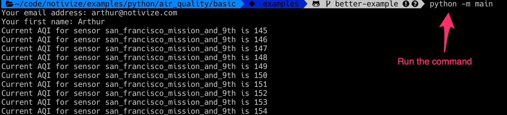
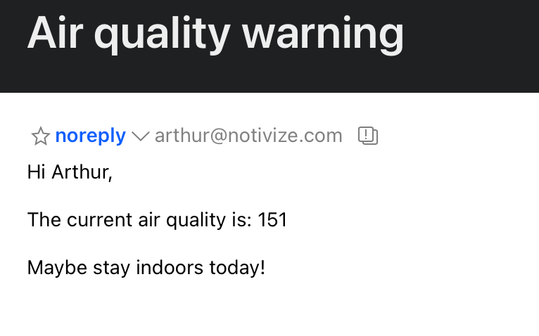

# Basic example

## Setup

We assume that you have a [virtual environment](https://docs.python.org/3/tutorial/venv.html) setup.
Then, open up your favorite terminal and `cd` to `examples/python/air_quality/basic`.


### Install dependencies

```bash
pip install -r requirements.txt
```

## Try it!


```bash
python -m main
```

You should get something like:



And receive only one email like:


