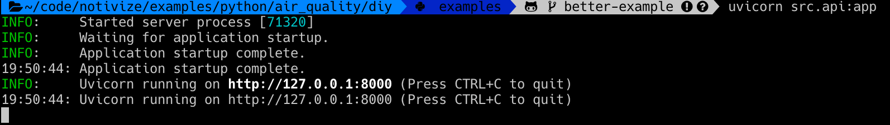

# Do It Yourself

Let's face it... Nobody ain't got time for that!

## Setup

We assume that you have a [virtual environment](https://docs.python.org/3/tutorial/venv.html) setup.
Then, open up your favorite terminal and `cd` to `examples/python/air_quality/basic`.

### Install dependencies

```bash
pip install -r requirements.txt
```

## Try it!

```bash
uvicorn src.api:app
```

You should get something like:



Then you can explore the api (`cmd + click` to open video link in new tab):

[](https://www.loom.com/share/0ed0095ccc75489d89dc67c72ed711d9)

## Reset

You can start from scratch by simply deleting the `diy.db` file.
