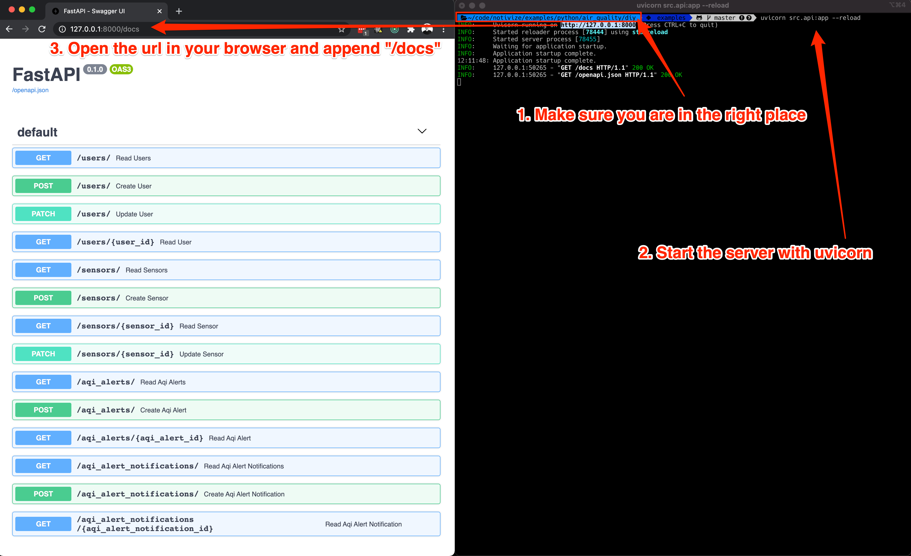
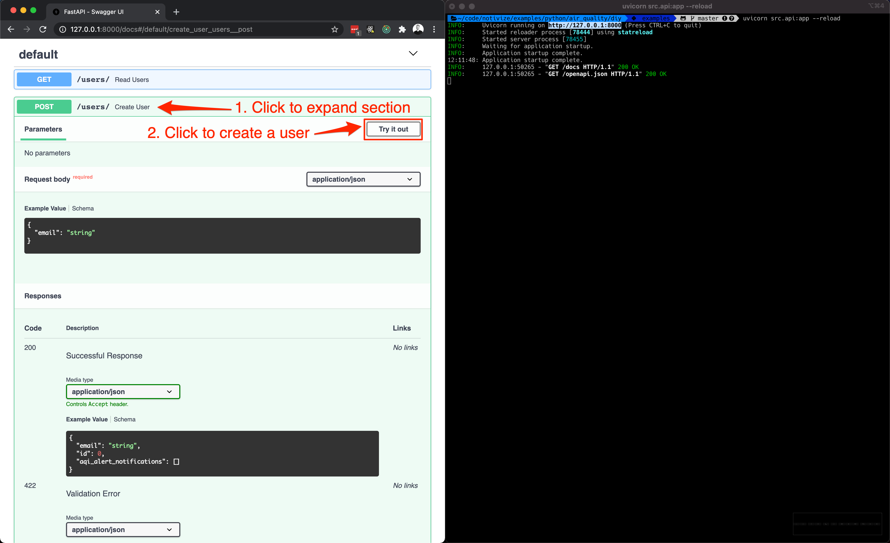
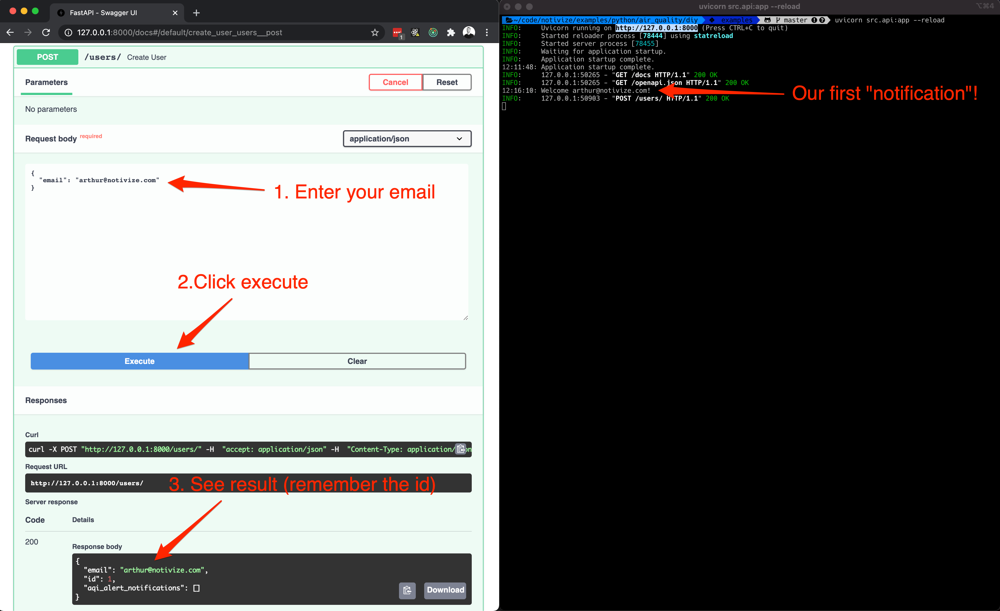
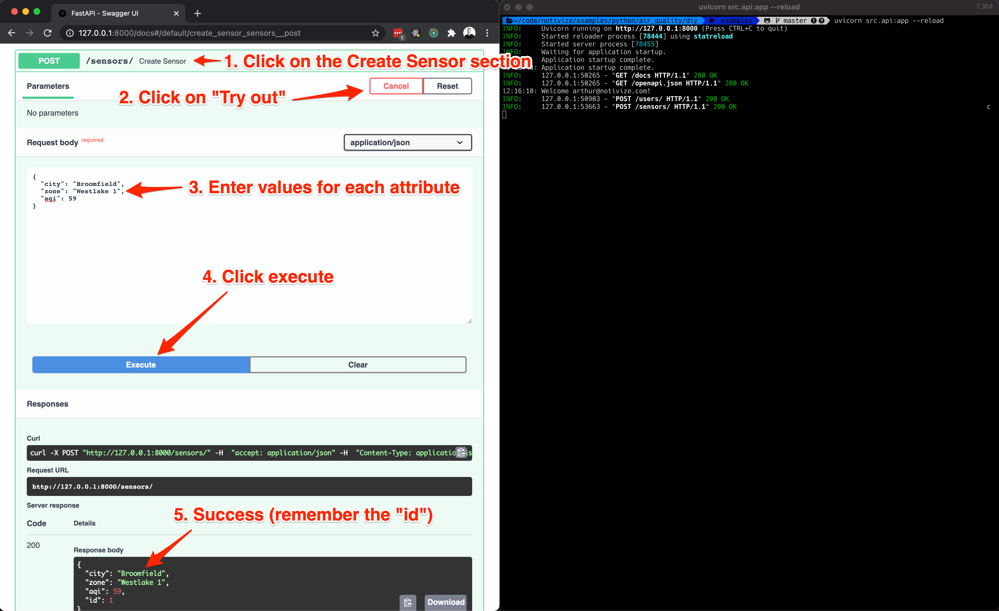
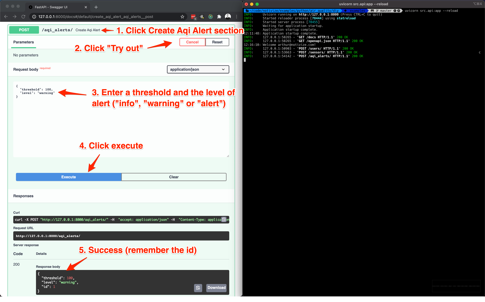
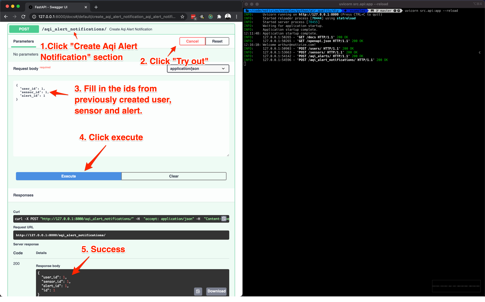
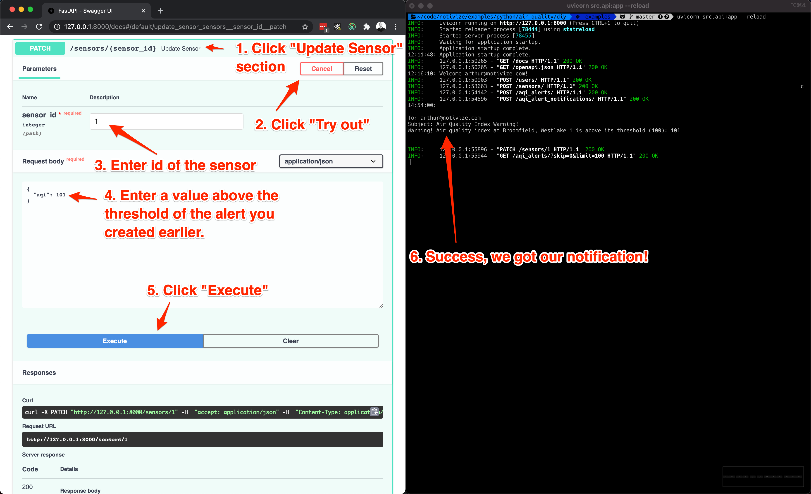
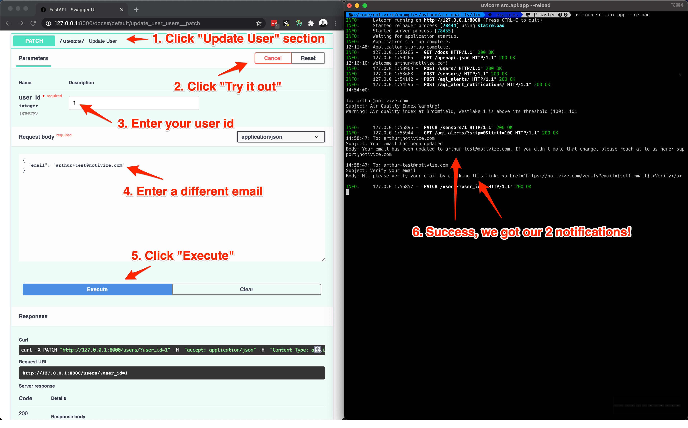
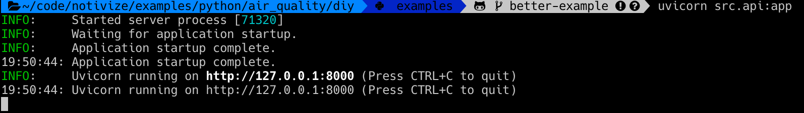

# Do It Yourself AQI (Air Quality Index) notification system

Let's face it... Nobody ain't got time for that!

## Overview

This example shows you how hard it can be to get notifications right, even for simple things.

### Setup

By default, the url to visit is: https://127.0.0.1:8000/docs.

#### Docker

We assume that you have the latest version of [docker](https://docs.docker.com/get-docker/) installed.
Then, open up your favorite terminal and `cd` to `examples/python/air_quality/diy`.

```bash
docker-compose up
```

If you use docker, the database will be seeded with 3 alerts ("info", "warning" and "alert") and 1 sensor.
You can check at:
- http://127.0.0.1:8000/sensors/
- http://127.0.0.1:8000/aqi_alerts/

#### Local machine

We assume that you have a [virtual environment](https://docs.python.org/3/tutorial/venv.html) setup.
Then, open up your favorite terminal and `cd` to `examples/python/air_quality/diy`.

```bash
pip install -r requirements.txt
uvicorn src.api:app --reload
```

## Tutorial

This tutorial will showcase 4 different notifications:
1. Get a welcome message when a user is created
2. Get an alert when a sensor has an AQI value above the threshold of an alert
3. Get an email that our email has been changed
4. Get an email to verify our new email

To setup an AQI notification, we'll need:
1. A user that signs up for alerts
2. A sensor that has an AQI value
3. An alert with a threshold
4. An alert notification that ties the 3 together:
  **If the sensor value is above the alert threshold, send a notification to the user.**


### 1. Start server



[Fastapi](https://fastapi.tiangolo.com) comes bundled with [Swagger UI](https://fastapi.tiangolo.com/#interactive-api-docs),
which is very handy to explore and play with your API. Simply open https://127.0.0.1:8000/docs in your browser and
you will see the list of available endpoints you can interact with.

### 2. How to open a section in the explorer view to submit an api request

This is to show you how to open an endpoint section and how to try it out (It's the same steps for all endpoints).



### 3. Create a user



### 4. Create a sensor



### 5 Create an AQI alert



### 6. Create an AQI alert notification



### 7. Trigger AQI alert notification



### 8. Update email




## Explore on your own

Start the server with:

```bash
uvicorn src.api:app
```

You should get something like:



Then you can explore the api (`cmd + click` to open video link in new tab):

[](https://www.loom.com/share/0ed0095ccc75489d89dc67c72ed711d9)

## Reset

You can start from scratch by simply deleting the `diy.db` file.
