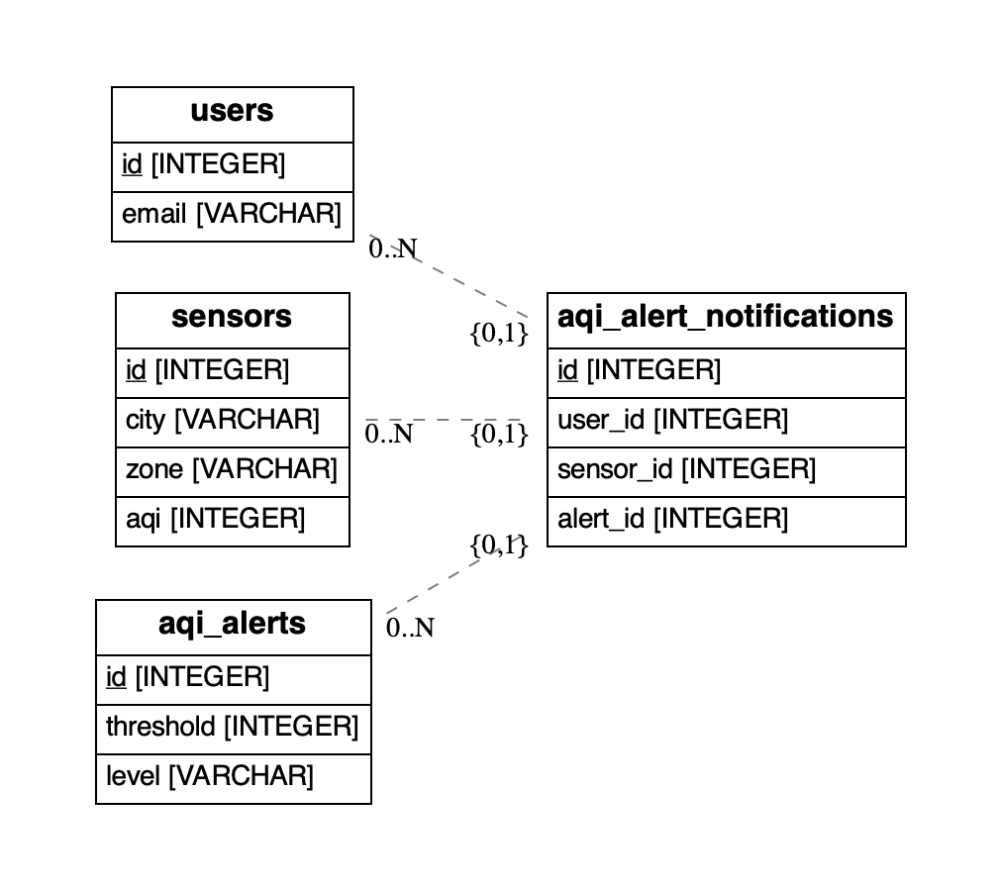

# Do It Yourself

Let's face it... Nobody ain't got time for that!

## Overview

This example shows you how hard it can be to get notifications right, even for simple things.

### Database schema



### Setup

We assume that you have a [virtual environment](https://docs.python.org/3/tutorial/venv.html) setup.
Then, open up your favorite terminal and `cd` to `examples/python/air_quality/basic`.

```bash
pip install -r requirements.txt
```

## Tutorial

This tutorial will showcase 4 different notifications:
1. Get a welcome message when a user is created
2. Get an alert when a sensor has an AQI value above the threshold of an alert
3. Get an email that our email has been changed
4. Get an email to verify our new email

### 1. Start server


### 2. How to open a section in the explorer view to submit an api request


### 3. Create a user


### 4. Create a sensor


### 5 Create aqi alert


### 6. Create aqi alert notification


### 7. Trigger aqi alert


### 8. Update email


## Explore on your own

```bash
uvicorn src.api:app
```

You should get something like:


Then you can explore the api (`cmd + click` to open video link in new tab):

[](https://www.loom.com/share/0ed0095ccc75489d89dc67c72ed711d9)

## Reset

You can start from scratch by simply deleting the `diy.db` file.
